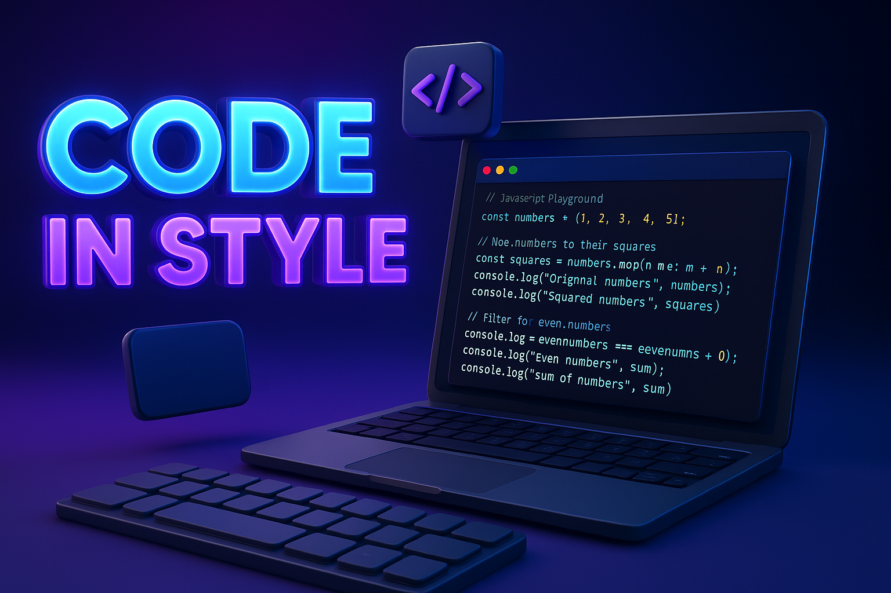

# SyntaxX - Code Sharing and Execution Platform



SyntaxX is a modern web application that allows developers to write, execute, and share code snippets in multiple programming languages. With a sleek, responsive interface and powerful features, SyntaxX makes coding and collaboration easier than ever.

## Features

### Core Features

- **Code Editor**: Write code with a feature-rich Monaco editor that includes syntax highlighting, auto-completion, and more
- **Code Execution**: Run your code directly in the browser and see results in real-time
- **Code Sharing**: Share your code snippets with others via unique URLs
- **Snippet Management**: Save, organize, and manage your code snippets
- **User Authentication**: Secure user authentication powered by Clerk
- **Responsive Design**: Fully responsive interface that works on desktop, tablet, and mobile devices

### Premium Features

- **Multiple Languages**: Support for multiple programming languages (JavaScript available for free users)
- **Advanced Execution**: Execute code in various languages with detailed output and error reporting
- **Snippet Comments**: Comment on shared code snippets to provide feedback or ask questions
- **Star System**: Star your favorite snippets to save them for later reference
- **User Profiles**: Personalized user profiles with execution statistics and favorite languages

## Technology Stack

- **Frontend**:
  - Next.js 15.0.3
  - React 18.3.1
  - TypeScript
  - Tailwind CSS for styling
  - Monaco Editor for code editing
  - Framer Motion for animations

- **Backend**:
  - Convex for backend services and database
  - Clerk for authentication and user management

- **Other Tools**:
  - Zustand for state management
  - React Hot Toast for notifications
  - React Syntax Highlighter for code display

## Getting Started

### Prerequisites

- Node.js (v18 or higher)
- npm or yarn

### Installation

1. Clone the repository:
   ```bash
   git clone https://github.com/yourusername/SyntaxX.git
   cd SyntaxX
   ```

2. Install dependencies:
   ```bash
   npm install
   # or
   yarn install
   ```

3. Set up environment variables:
   Create a `.env.local` file in the root directory with the following variables:
   ```
   NEXT_PUBLIC_CLERK_PUBLISHABLE_KEY=your_clerk_publishable_key
   CLERK_SECRET_KEY=your_clerk_secret_key
   NEXT_PUBLIC_CONVEX_URL=your_convex_url
   ```

4. Start the development server:
   ```bash
   npm run dev
   # or
   yarn dev
   ```

5. Open [http://localhost:3000](http://localhost:3000) in your browser to see the application.

## Project Structure

```
SyntaxX/
├── convex/                 # Convex backend functions and schema
├── public/                 # Static assets
├── src/
│   ├── app/                # Next.js app router pages
│   ├── components/         # Reusable React components
│   ├── hooks/              # Custom React hooks
│   ├── store/              # Zustand state management
│   └── types/              # TypeScript type definitions
├── .env.local              # Environment variables (not in repo)
├── next.config.ts          # Next.js configuration
├── package.json            # Project dependencies
└── tailwind.config.ts      # Tailwind CSS configuration
```

## Key Components

- **EditorPanel**: The main code editor component with Monaco editor integration
- **OutputPanel**: Displays code execution results with syntax highlighting
- **NavigationHeader**: Main navigation component with authentication controls
- **ShareSnippetDialog**: Dialog for sharing code snippets
- **StarButton**: Component for starring/unstarring snippets

## Database Schema

The application uses Convex for data storage with the following collections:

- **users**: User information and subscription status
- **codeExecutions**: Records of code executions with language, code, and output
- **snippets**: Saved code snippets with title, language, and code
- **snippetComments**: Comments on shared snippets
- **stars**: Records of which users have starred which snippets

## Authentication

SyntaxX uses Clerk for authentication, providing:
- Email/password login
- Social login options
- User profile management
- Secure session handling

## Deployment

The application can be deployed to Vercel or any other Next.js-compatible hosting platform:

```bash
npm run build
# or
yarn build
```

## Contributing

Contributions are welcome! Please feel free to submit a Pull Request.

1. Fork the repository
2. Create your feature branch (`git checkout -b feature/amazing-feature`)
3. Commit your changes (`git commit -m 'Add some amazing feature'`)
4. Push to the branch (`git push origin feature/amazing-feature`)
5. Open a Pull Request

## License

This project is licensed under the terms of the license included in the repository.

## Acknowledgements

- [Next.js](https://nextjs.org/)
- [React](https://reactjs.org/)
- [Convex](https://www.convex.dev/)
- [Clerk](https://clerk.dev/)
- [Monaco Editor](https://microsoft.github.io/monaco-editor/)
- [Tailwind CSS](https://tailwindcss.com/)
- [Framer Motion](https://www.framer.com/motion/)